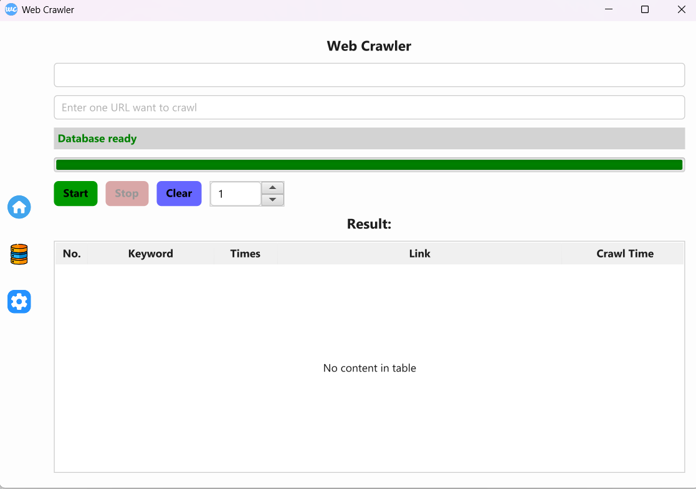
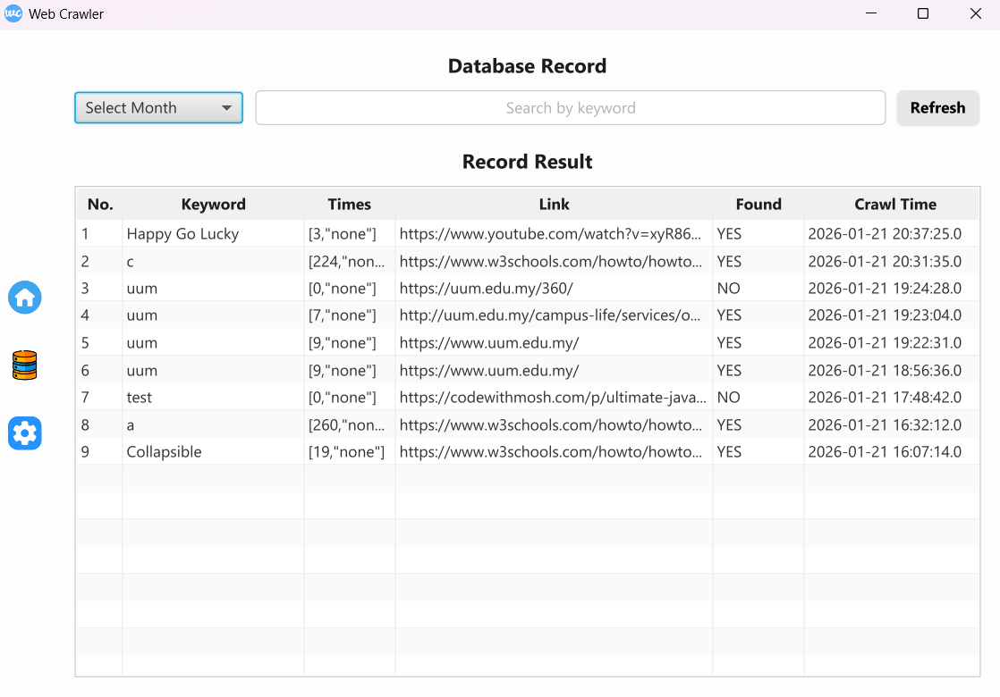
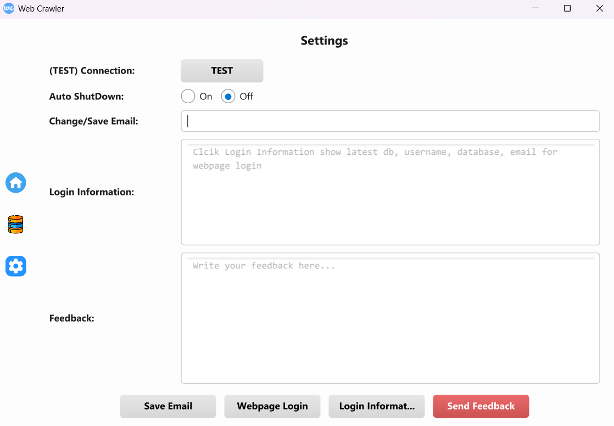

# Web Crawler (JavaFX)

A JavaFX desktop application that crawls websites, searches for a keyword on each page, and stores crawl results in a MySQL database.

---

## Features
- ✅ Crawl websites based on a user-defined **keyword**, **start URL**, and **page limit** (same-domain crawling only)
- ✅ Extract visible page text using **static HTML fetching** and **Selenium-rendered content**
- ✅ Remove HTML tags to produce **clean, searchable text** and extract same-domain URLs
- ✅ Analyze cleaned text to **count keyword frequency** on each page
- ✅ Save crawl results into **MySQL**
- ✅ View crawl history with **search and month filtering**
- ✅ Automatic **Light/Dark theme detection** based on OS settings
- ✅ Optional **auto shutdown** after crawling completes
- ✅ **Logging and bug report email** sent to the author (includes system information and logs)

---

## Screens / Pages

### Main Page
Run crawler tasks and view results from the current crawl session.

---

### Database Page
View and search stored crawl records, with optional month filtering.

---

### Settings Page
Save email address, enable auto shutdown, submit feedback, and access login/website URLs.

---

## How It Works

1. User enters a **keyword**, **start URL**, and **page limit**
2. Application checks URL accessibility
3. Page content is fetched using:
   - Static HTML fetching (no JavaScript)
   - Selenium-rendered content with JavaScript and scrolling
   - Selenium visible body text
4. Keyword occurrences are counted
5. Internal same-domain links are collected and added to a crawl queue
6. Each page result is saved into the database
7. The TableView updates with results from the current run

---

## Tech Stack
- Java 17+
- JavaFX
- Selenium (ChromeDriver)
- Jsoup
- MySQL (JDBC Driver)

---

## Setup

### 1) Requirements
- Java 17 or later
- Google Chrome
- ChromeDriver compatible with your Chrome version
- MySQL server running and accessible

---

### 2) MySQL Configuration
Configure the following in the source code:
- Database URL
- Database username
- Database password

The application automatically:
- Creates an admin database named `webcrawler` (if missing)
- Creates a registry table `available`
- Generates a **unique per-machine database and user** (based on Windows UUID)
- Creates a `data` table inside the per-machine database

---

### 3) SMTP Configuration
Configure the following for email notifications:
- Sender email address
- Email password
- SMTP host
- SMTP port

These settings are required for sending logs and bug reports

---

## Notes
- Some websites may block crawling or trigger CAPTCHA challenges. This program does not support CAPTCHA bypassing.

---

